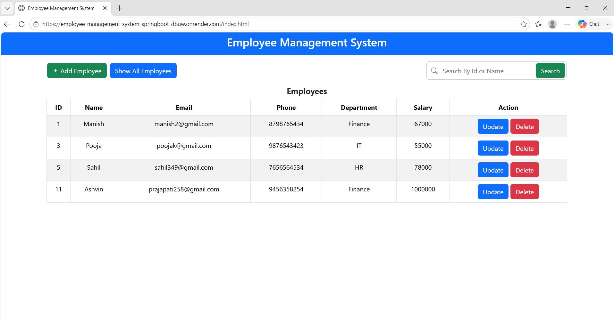
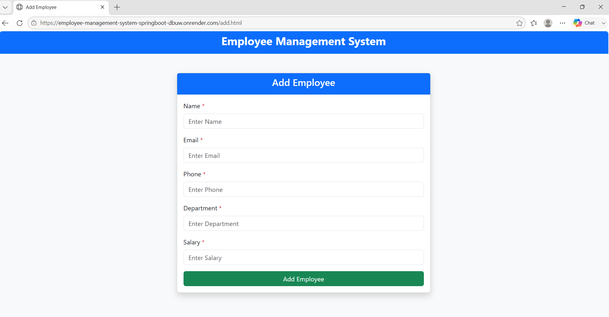
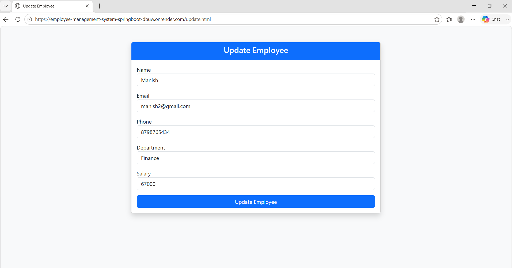

# Employee Management System

A full-stack Employee Management System built using Spring Boot, Spring Data JPA, PostgreSQL, HTML, CSS, Bootstrap, and JavaScript. The application allows users to perform employee management operations through a responsive web interface and is deployed on Render using a Neon PostgreSQL database.

## Live Demo 
**Live Application:** 
https://employee-management-system-springboot-dbuw.onrender.com

## Features

- Add Employee
- View All Employees
- Search Employee by ID
- Search Employee by Name
- Update Employee Details
- Delete Employee
- Form Validation
- Exception Handling
- Success and Error Notifications

## Technologies Used

### Backend
- Java 
- Spring Boot
- Spring Data JPA
- Hibernate
- PostgreSQL
- Maven

### Database 
- PostgreSQL 
- Neon Database 

### Validation 
- Jakarta Bean Validation

### Deployment 
- Render

### Frontend
- HTML
- CSS
- Bootstrap 5
- JavaScript
- Fetch API

## API Endpoints

| Method | Endpoint | Description | 
|--------|----------|-------------| 
| POST | `/employees` | Add employee | 
| GET | `/employees` | Get all employees | 
| GET | `/employees/{eid}` | Get employee by ID | 
| PUT | `/employees/{eid}` | Update employee | 
| PATCH | `/employees/{eid}` | Update selected fields | 
| DELETE | `/employees/{eid}` | Delete employee | 
| GET | `/employees/search?keyword=name` | Search employee by name |

## Screenshots

### Home Page


### Add Employee


### Update Employee


## Validation Rules

- Name is required
- Email must be valid
- Phone number must contain exactly 10 digits
- Department cannot contain numbers
- Salary must be greater than 0

## Exception Handling

- ResourceNotFoundException
- MethodArgumentNotValidException
- Global Exception Handler

## Project Structure

```
src
├── controller
├── service
├── repository
├── entity
├── dto
└── exception
```

## How to Run Locally

1. Clone the repository.
2. Configure PostgreSQL database.
3. Update application.properties.
4. Run the Spring Boot application.
5. Open the application in your browser.

```
http://localhost:8080
```

## Future Improvements

- Pagination
- Sorting
- Authentication and Login
- Role-Based Access Control

## Author

Monica Prajapati